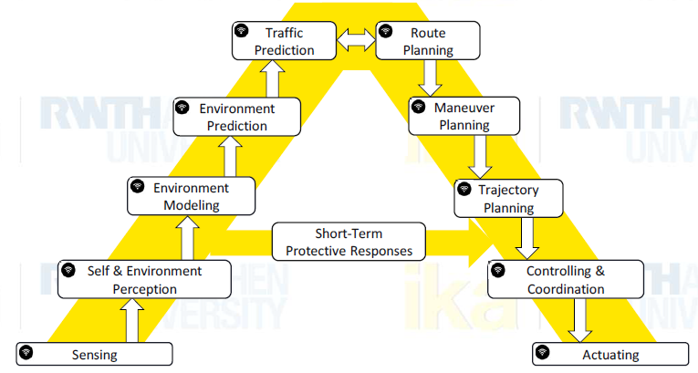
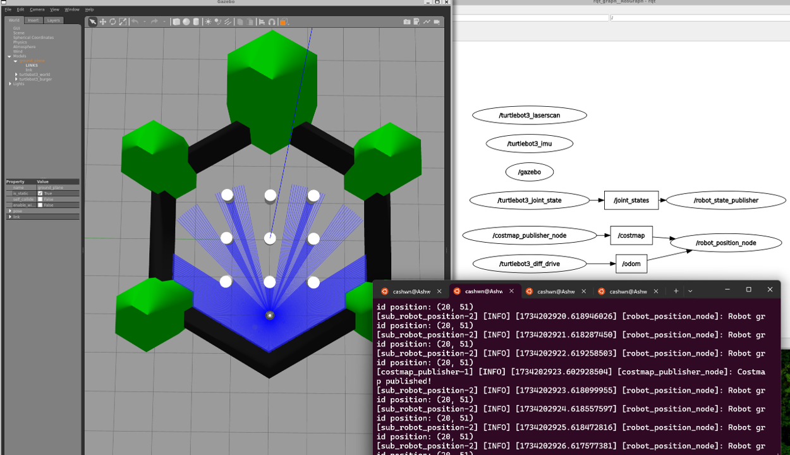

# Evaluating path planning methods on mobile robots using ROS2

### The idea of this project is to evaluate and implement the various global path planning approaches to perform autonomous navigation of mobile robots and compare on the performance of various approaches.

<caption>A-model architecture for designing an autonomous vehicle or robot.</caption>

### For this project, the following approach is followed :

* #### Teleoperating the robot to scan the environment
* #### Creating a costmap from the scanned environment
* #### Creating a global path planner which generates a path to the goal
* #### Creating a local controller which can stabilize the robot and perform obstacle avoidance

## 1. Environment modelling

